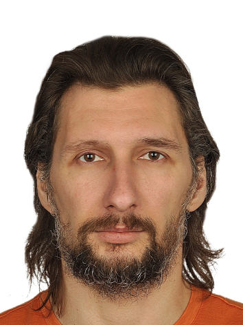

# Алёхин Алексей Валерьевич

## Контакты
+7(964)890-05-94\
av.alyokhin@yandex.ru

## О себе
Начал писать код в середине 90-х, под MS DOS - да, я из тех кто ещё застал `int 10h` и `int 16h` )
В основном работал с графикой, поэтому это была связка `C`/`Assembler`.\
В 2004 открыл свою фирму - проектировали и внедряли АСУТП на производствах. Именно в этот период, 
сформировался как профессионал, и пришло понимание, что техническая деятельность мне гораздо ближе, чем административная.\
В 2008 закрыл фирму, устроился в тогда ещё небольшую инженерную организацию, где в итоге, к 2013 году сформировал под себя отдел АСУТП.

## Навыки

- Опыт разработки для систем с сильно ограниченными ресурсами (слабые CPU, малый объём RAM)
- Совместная работа с большой кодовой базой
- Умение работать как в команде, так и самостоятельно

**Языки:** 
- Уверенно: `C++20`, `Lua`, а так же [`LD`, `FBD`, `SFC`, `ST/SCL`] - стек стандартных языков для промышленных контроллеров
- Есть общее понимание и некоторый опыт: `SQL`, `Lisp/Scheme/Racket`, `Assembler`, `Python`
  
**Инструменты:** `git`, `CMake`, VS Code,
  
**Целевые платформы:** Linux, MS Windows, MS DOS.

**Английский язык:** на уровне свободного чтения документации

**Кроме того:** Обладаю лидерскими качествами, готов брать на себя инициативу и ответственность. Коммуникабельный с хорошо развитым чувством юмора.

* По мере необходимости вношу посильный вклад в сторонние опенсорс проекты. Из тех, что на слуху:`CMake` [PR10635](https://gitlab.kitware.com/cmake/cmake/-/merge_requests/10635)

## Профессиональный опыт

### [2020-настоящее время] (5 лет)

Работа над open source проектом [`Wargus/Stratagus`](https://github.com/Wargus/stratagus)

- Устранение багов
- Оптимизация алгоритмов и реализация новых функций
- Реализация новых игровых механик
- Добавление инструментов в редактор

### [2004-настоящее время] (21 год)

В основном профессиональный опыт связан с проектированием, программированием, монтажом и пусконаладочными работами АСУТП и инженерных систем, а так же, начиная с 2013 года, с организацией и руководством выполнения этих видов работ в качестве руководителя отдела:
- Проектирование
- Разработка ПО для свободно программируемых контроллеров
- Разработка текстовых и графических интерфейсов оператора для взаимодействия с системами автоматизации
- Разработка систем диспетчеризации (SCADA)
- Пусконаладочные работы

-----
## Опыт в разработке

### 1. Stratagus | Wargus | War1gus
---
GitHub: [github.com/Wargus/stratagus](github.com/Wargus/startagus)\
GitHub: [github.com/Wargus/wargus](github.com/Wargus/wargus)\
GitHub: [github.com/Wargus/war1gus](github.com/Wargus/war1gus)\
`C++17`, `Lua`, `SDL2`

2D RTS game engine и альтернативные реализации WarCraft (War1gus) / WarCraft II (Wargus) на нём.

С 2023 года вошёл в состав основной команды разработчиков.

Все изменения с учётом обратной совместимости для уже готовых 2-х игр

**Крупные вклады:**

#### Field of View & Fog of War System ([Stratagus PR330](https://github.com/Wargus/stratagus/pull/330), [Wargus PR359 (Lua)](https://github.com/Wargus/wargus/pull/359), [War1gus PR185 (Lua)](https://github.com/Wargus/war1gus/pull/185) — 150+ коммитов, 3500+ изменений)

- Спроектировал и реализовал механизм блокировки поля зрения юнитов (FOV): видимость заблокирована через непрозрачные тайлы и возвышенности.
- Добавил поддержку опциональной установки непрозрачности для отдельных видов тайлов (скалы, стены, лес и т.д.)
- Для нового режима FOV переработал систему тумана войны (FOW), добавив генерируемый растровый тип (в дополнение к оригинальному тайловому) с возможностью задания таких параметров, как радиус размытия, билинейная интерполяция, количество шагов сглаживания для гладкого отображения.
- Реализовал распараллеливание узких мест через `OpenMP` (до этого проект в принципе был однопоточным), в добавок часть расчётов растянул на несколько кадров.
- Оптимизировал расчёт совместной видимости для нескольких игроков (shared vision).
- Реализовал несколько механизмов для отладки, в т.ч. возможность изменения параметров FOV на лету в мультиплеере без рассинхронизации.
- Интегрировал в основной движок, Wargus и War1gus с сохранением обратной совместимости; прошёл множество циклов рефакторинга.

#### Highgrounds Support, Tileset Generator ([Stratagus PR418](https://github.com/Wargus/stratagus/pull/418), [Wargus PR446 (Lua)](https://github.com/Wargus/wargus/pull/446) — 170+ коммита, 5200+ изменений)

- Добавил поддержку системы возвышенности для тайлов карты; обратно совместимо с существующими картами.
- Расширил формат тайлсета с новыми слотами для хай- и лоугранда, рамп, скал с переходами.
- Реализовал тайлсет-генератор для автоматической генерации расширенной графики (скалы, рампы, переходы между уровнями высот) из оригинальных тайлсетов для сохранения графического стиля оригинальной игры.
- Разработал сложный парсер и DSL для конфигурации генератора: поддержка нескольких операций преобразования пикселей (remove colors, shift color, flip, chroma-key mask), слои, диапазоны, композиция.
- Добавил в редактор: инструменты установки высоты, подсветку уровней.
- Составил документацию с описанием DSL и инструкциями по использованию новых возможностей: [Highgrounds-support](https://github.com/Wargus/stratagus/wiki/Highgrounds-support).

#### Editor Brushes System ([Stratagus PR732](https://github.com/Wargus/stratagus/pull/732), [Wargus PR488 (Lua)](https://github.com/Wargus/wargus/pull/488) — 80+ коммита, 3100+ изменений)

- Разработал систему кистей (brushes) для редактора с поддержкой гибкой конфигурации через Lua.
- Реализовал несколько типов кистей:
  * SingleTile — стандартная кисть с авто-подгонкой соседних тайлов, с возможностью изменения размера и активации различных опций редакирования.
  * Decoration — генерируемые патчи тайлов (например, рампы, мультитайловые декорации).
  * MultiTile.
- Добавил Lua-конфигурируемый генератор для декораций и рамп с опциями (направление, тип хай- и лоуграунда).
- Реализовал UI для управления кистями: выбор кистей из dropdown, параметры (размер, рандомизация тайлов, режим "decoration").
- Осуществил глубокую пререработку UI генератора.

#### Automatic Targeting Algorithm (PR271 — 29 коммитов, 697 изменений)

- Переработал существующую логику автоматического выбора целей для юнитов, исправив существенные проблемы с приоритетами и фиксацией на одной цели.
- Реализовал альтернативный алгоритм автоматического выбора целей по типу StarCraft 2:
  * Приоритизация: угрозы (враги в пределах дальности) → приоритет юнита → дистанция пути-нахождения.
  * Цель переключается при появлении более приоритетной в пределах reaction range.
  * Юниты с минимальной дальностью атаки большей, чем расстояние до цели автоматически занимают оптимальную позицию для атаки.
  * При атаке со стороны врага находящегося вне поля видимости, юнит получает команду на attack-move в примерный регион карты откуда была осуществлена атакка. 
- Добавил визуализацию: две линии для attack-move (текущая цель + целевой тайл).
- Добавил возможность изменения алгоритма автоматического выбора целей одновременно для всех клиентов в мультиплеере, для избежания рассинхронизации.

**Результат:**

- Существенное повышение стабильности за счёт внесения мелких улучшений в кодовую базу и исправлений существующих багов.
- Значительное улучшение игровой механики (видимость, возвышенности, автотаргетинг).
- Расширенный инструментарий редактора для дизайнеров карт.
- Сложные высоконагруженные алгоритмы (блокирование видимости, генерация графики, поиск целей).
- Сотрудничество с основной командой: участие в ревью, итеративный процесс, кроссплатформенное тестирование.

### Личные проекты:
### 2. Sandboxed Lua Runtime
---

**Механизм для безопасного выполнения недоверенных Lua-скриптов в C++ приложении.**\
GitHub: [github.com/ipochto/luaSandboxes](github.com/ipochto/luaSandboxes)\
`C++20`, `Lua`, `sol2`

**Ключевые достижения:**
- Спроектировал и реализовал модель песочницы, позволяющую создавать несколько
независимых окружений на одном Lua‑стейте.
- Разработал правила загрузки библиотек (белые/черные списки, пресеты Core/Minimal/Complete/Custom), частичную подгрузку и замену опасных функций (`loadfile`, `dofile`, `require`, `print`, etc.).
- Добавил валидацию путей и запрет на выполнение Lua‑байткода при загрузке внешних скриптов.
- Внедрил ограничение по памяти через кастомный аллокатор, отслеживающий выделения и поддерживающий общий лимит для всех песочниц.
- Реализовал ограничение времени выполнения: Lua‑хуки + RAII‑обёртка.
- Обеспечил контроль обработки ошибок выполнения без выброса исключений.

**Build-инфраструктура и интеграция:**
- Настроил CI‑pipeline (GitHub Actions) для кроссплатформенной сборки (Linux/Windows) с GCC, Clang, MSVC, Clang-cl.
- Обеспечил возможность лёгкого подключения к сторонним CMake‑проектам в качестве библиотеки, которая сама тянет и расшаривает все зависимости, необходимые для интеграции Lua.

**Результат:**
1. Библиотека, готовая к использованию в игровых движках, серверных приложениях, учебных проектах.
2. Оформил работу в формате туториала: цикл технических статей на Habr, где подробно разобрал архитектуру и используемые решения для изоляции окружений и контроля ресурсов: [«Изолируем Lua окружение в C++ приложении»](https://habr.com/ru/users/alyokhin/articles).

### 3. Akhenaten TTS Tool
---
**CLI-утилита для генерации голосовых реплик персонажей для open-source игрвого движка [Akhenaten](https://github.com/dalerank/Akhenaten)**\
GitHub: [https://github.com/ipochto/akhenaten-tts](https://github.com/ipochto/akhenaten-tts)\
`C++20`, `Piper TTS`, `Lua`, `sol2`, `cpr`

**Ключевые достижения:**
- Спроектировал пайплайн синтеза речи: интеграция с `Piper TTS` API для обработки текста в аудио, поддержка нескольких языков и спикеров.
- Реализовал конфигурацию через Lua-скрипты: описал голосовые модели (ONNX-файлы с Hugging Face), персонажей и спикеров; добавил поддержку динамических настроек.
- Внедрил автоматическую загрузку и кэширование моделей: через `cpr`/`curl` скачивает и хранит модели локально, с проверкой наличия.
- Использовал `luaSandboxes` для безопасной загрузки конфигурации: изолировал Lua-скрипты, предотвращая выполнение вредоносного кода.
- Разработал CLI-интерфейс: опции для фразы, персонажа, языка, выхода; поддержка batch-генерации реплик.
- Реализовал генерацию WAV-файлов: формирование PCM-заголовка, потоковую запись аудио без промежуточных буферов.

**Build-инфраструктура и интеграция:**
- Настроил кроссплатформенную CMake-сборку с автоматическим подтягиванием зависимостей; Нашёл причины ошибок сборки/линковки и подготовил патчи для исходного кода и build-скриптов upstream-зависимостей (`libpiper`, `espeak-ng`).
- Настроил CI‑pipeline (GitHub Actions) для кроссплатформенной сборки (Linux/Windows) с GCC, Clang, MSVC, Clang-cl.

**Результат:** готовая утилита для озвучки игровых диалогов, с акцентом на автоматизацию и безопасность. Кроме того, в качестве сайд-эффекта данный проект демонстрирует практическое применение `luaSandboxes` в реальном приложении.

## Технические публикации
### Изолируем Lua окружение в C++ приложении (цикл статей):
- [Часть 1: Библиотеки](https://habr.com/ru/articles/987882/)
- [Часть 2: Изоляция скриптов в файловой системе](https://habr.com/ru/articles/987990/)
- [Часть 3: Ограничение ресурсов](https://habr.com/ru/articles/991960/)

## Инженерные практики
Кроссплатформенная разработка
- разработка и тестирование на Linux и Windows
- поддержка нескольких компиляторов: GCC, Clang, MSVC, Clang-cl

Build-инфраструктура
- кроссплатформенная сборка на CMake
- управление зависимостями через FetchContent и ExternalProject
- интеграция native библиотек (Lua, Piper TTS, espeak-ng)
- патчи upstream зависимостей для стабильной сборки

CI
- автоматическая сборка проектов в CI (GitHub Actions)
- проверка сборки на нескольких компиляторах и платформах

Интеграция сторонних библиотек
- отладка проблем сборки
- адаптация build-скриптов сторонних проектов

------

